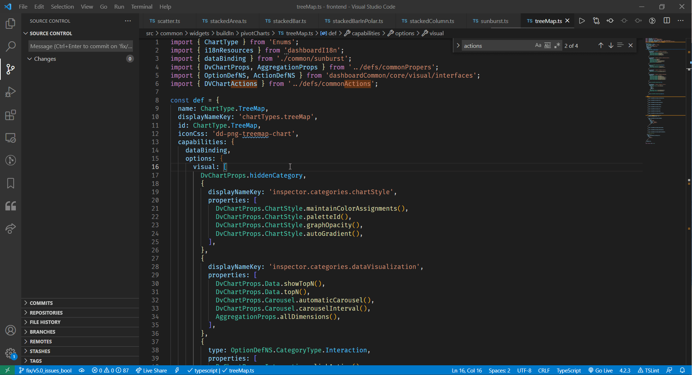

# Wyn Dev Tools

Wyn dashboard dev tools

## Usage
--------

- F1 -> Input "wyn: Add an action"

- F1 -> Input "wyn: Delete local branch"

- F1 -> Input "wyn: en -> zh & es & pl"

- F1 -> Input "wyn: zh -> zh-TW"

- F1 -> Input "wyn: Import current file to closest main.scss"

- F1 -> Input "wyn: Diff"

- F1 -> Input "wyn: Translation"

### Open Setting.json -> click Extensions -> click 'wyn-dev-tools' -> click 'Edit in setting.json' -> edit hoverMapping object

-------
